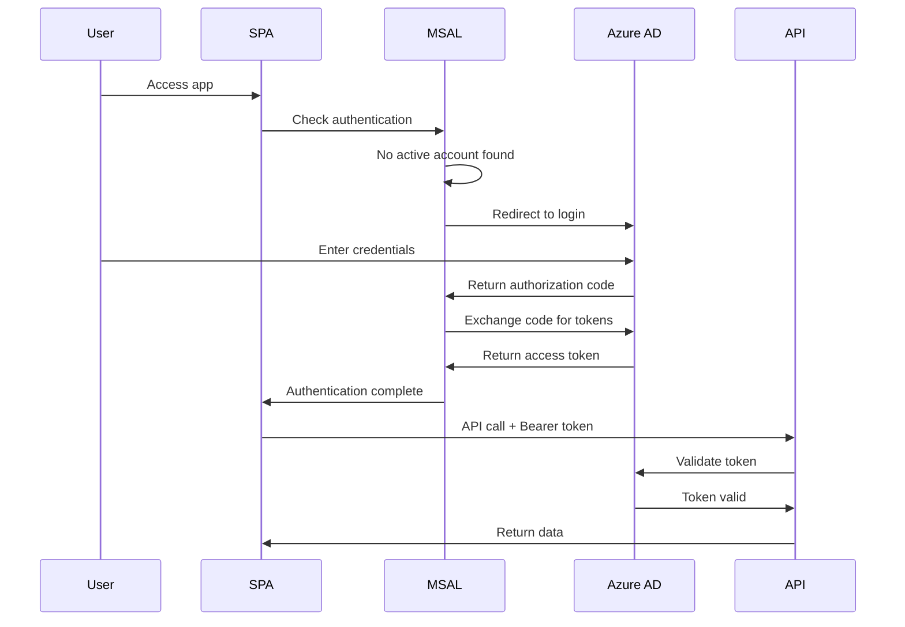

# 📘 Developer Guide - HB Catalog Application
**Version:** 2.0  
**Last Updated:** November 21, 2025

---

## 📑 Table of Contents
1. [Getting Started](#getting-started)
2. [Project Structure](#project-structure)
3. [Authentication Flow](#authentication-flow)
4. [API Documentation](#api-documentation)
5. [Search Implementation](#search-implementation)
6. [Deployment](#deployment)
7. [Troubleshooting](#troubleshooting)
8. [Best Practices](#best-practices)

---

## 🚀 Getting Started

### Prerequisites
- Node.js 20.x or higher
- Azure CLI
- Git
- Visual Studio Code (recommended)
- Azure Functions Core Tools v4

### Local Development Setup

#### 1. Clone Repository
```bash
git clone https://github.com/mictlanmex/klinik-catalog.git
cd klinik-catalog
```

#### 2. Backend Setup (Function App)
```bash
cd hb-catalog-api
npm install
```

Create `local.settings.json`:
```json
{
  "IsEncrypted": false,
  "Values": {
    "FUNCTIONS_WORKER_RUNTIME": "node",
    "AzureWebJobsStorage": "",
    "SHOPIFY_SHOP": "haut-boutique-6907.myshopify.com",
    "SHOPIFY_TOKEN": "shpat_xxxxx",
    "CLINIC_LOCATION_ID": "gid://shopify/Location/78561935661",
    "FEATURE_TOPDOCTORS_TAG": "topdoctores"
  }
}
```

Start local backend:
```bash
func start
```

#### 3. Frontend Setup (React + Vite)
```bash
cd hb-catalog-ui
npm install
```

Create `.env` file:
```env
VITE_API_BASE=http://localhost:7071
VITE_AZURE_CLIENT_ID=763dfb3f-4c23-4b49-aa28-9cf7d78b6c4a
VITE_AZURE_TENANT_ID=your-tenant-id
VITE_AZURE_API_SCOPE=api://2b18b55b-cf19-41e3-ae23-c17aa8411e75/access_as_user
```

Start local frontend:
```bash
npm run dev
```

---

## 📂 Project Structure

```
klinik-catalog/
├── .github/
│   └── workflows/
│       ├── deploy-function.yml    # Backend CI/CD
│       └── deploy-swa.yml         # Frontend CI/CD
│
├── hb-catalog-api/               # Backend (Azure Function)
│   ├── index.js                  # Entry point
│   ├── products.js               # Products endpoint
│   ├── health.js                 # Health check endpoint
│   ├── host.json                 # Function App config
│   ├── package.json              # Dependencies
│   └── .funcignore               # Files to exclude from deployment
│
├── hb-catalog-ui/                # Frontend (React + Vite)
│   ├── public/
│   │   └── haut-logo.png        # Logo
│   ├── src/
│   │   ├── main.jsx             # Entry point
│   │   ├── App.jsx              # Main component
│   │   ├── App.css              # Styles
│   │   ├── auth.js              # MSAL configuration
│   │   └── index.css            # Global styles
│   ├── index.html               # HTML template
│   ├── vite.config.js           # Vite configuration
│   ├── package.json             # Dependencies
│   ├── .env.example             # Environment template
│   └── .gitignore               # Git ignore rules
│
├── PRD_HB_Catalogo_Clinica.md   # Product Requirements
└── DEVELOPER_GUIDE.md           # This file
```

---

## 🔐 Authentication Flow

### Overview
The application uses **OAuth 2.0 Authorization Code Flow with PKCE** via MSAL.js.

### Authentication Sequence



### Key Files

#### `auth.js` - MSAL Configuration
```javascript
import { PublicClientApplication } from "@azure/msal-browser";

const msalConfig = {
  auth: {
    clientId: import.meta.env.VITE_AZURE_CLIENT_ID,
    authority: `https://login.microsoftonline.com/${import.meta.env.VITE_AZURE_TENANT_ID}`,
    redirectUri: window.location.origin,
  },
  cache: {
    cacheLocation: "sessionStorage",  // Tokens in memory
    storeAuthStateInCookie: false,
  },
};

export const msal = new PublicClientApplication(msalConfig);
```

#### Token Acquisition
```javascript
async function getAccessToken() {
  const accounts = msal.getAllAccounts();
  if (accounts.length === 0) throw new Error("No active account");

  const request = {
    scopes: [import.meta.env.VITE_AZURE_API_SCOPE],
    account: accounts[0],
  };

  try {
    // Try silent token acquisition
    const response = await msal.acquireTokenSilent(request);
    return response.accessToken;
  } catch (error) {
    // Fallback to interactive
    const response = await msal.acquireTokenRedirect(request);
    return response.accessToken;
  }
}
```

### Common Issues & Solutions

#### 403 Forbidden Error
**Cause:** Function App not configured to accept SPA's Application ID

**Solution:**
1. Go to Function App → Authentication
2. Set "Client application requirement" to "Specific clients"
3. Add SPA Application ID: `763dfb3f-4c23-4b49-aa28-9cf7d78b6c4a`

#### Token Expiration
**Handled automatically by MSAL.js:**
- `acquireTokenSilent()` refreshes expired tokens
- Falls back to `acquireTokenRedirect()` if needed

---

## 📡 API Documentation

### Base URL
- **Local:** `http://localhost:7071/api`
- **Production:** `https://hb-catalog-api-7856.azurewebsites.net/api`

### Authentication
All endpoints except `/health` require Bearer token:
```
Authorization: Bearer <access_token>
```

### Endpoints

#### `GET /health`
Health check endpoint (no auth required)

**Response:**
```json
{
  "status": "ok",
  "timestamp": "2025-11-21T19:00:00.000Z"
}
```

#### `GET /products`
Retrieve products with optional filtering

**Query Parameters:**
| Parameter | Type | Required | Default | Description |
|-----------|------|----------|---------|-------------|
| `query` | string | No | "" | Search term (title, vendor, tags) |
| `first` | number | No | 20 | Products per page (max 50) |
| `after` | string | No | null | Pagination cursor |

**Example Requests:**
```bash
# Get first 50 products
GET /products?first=50

# Search for "acne" products
GET /products?query=acne&first=50

# Get next page
GET /products?query=acne&first=50&after=eyJsYXN0X2lkIjo...
```

**Response:**
```json
{
  "pageInfo": {
    "hasNextPage": true,
    "endCursor": "eyJsYXN0X2lkIjo..."
  },
  "count": 50,
  "items": [
    {
      "id": "gid://shopify/Product/123",
      "title": "Acne Treatment Gel",
      "handle": "acne-treatment-gel",
      "vendor": "La Roche-Posay",
      "isTopDoctor": true,
      "image": "https://cdn.shopify.com/...",
      "variants": [
        {
          "id": "gid://shopify/ProductVariant/456",
          "title": "30ml",
          "sku": "LRP-ACN-30",
          "available": 15
        }
      ]
    }
  ]
}
```

---

## 🔍 Search Implementation

### Search Architecture

The search system uses a **two-layer approach**:

1. **Shopify GraphQL Query** (broad search)
   - Initial filtering via Shopify's search API
   - Normalized, sanitized terms
   - Performance: Fast (server-side)

2. **Client-Side Filtering** (precise matching)
   - Flexible partial matching
   - Accent-insensitive comparison
   - Multi-field search

### Search Flow

```javascript
// 1. User types search term
const query = "acné tratamiento";

// 2. Build Shopify query with normalized terms
function buildProductQuery({ query }) {
  const normalizedTerms = query
    .split(' ')
    .map(term => norm(term))  // Remove accents, lowercase
    .map(term => term.replace(/[^a-z0-9]/g, ''));  // Sanitize
  
  // Each term must match in title, vendor, OR tags
  const parts = normalizedTerms.map(term => 
    `(title:${term}* OR vendor:${term}* OR tag:${term}*)`
  );
  
  return parts.join(' AND ') + ' AND status:active';
}

// Result: "(title:acne* OR vendor:acne* OR tag:acne*) AND 
//          (title:tratamiento* OR vendor:tratamiento* OR tag:tratamiento*) AND 
//          status:active"

// 3. Get results from Shopify
const shopifyResults = await shopifyGql(PRODUCTS_GQL, { query: shopifyQuery });

// 4. Apply client-side filtering for precision
const searchTerms = ["acne", "tratamiento"];  // Normalized

items = shopifyResults.filter(product => {
  const matchesTitle = matchesSearch(product.title, searchTerms);
  const matchesVendor = matchesSearch(product.vendor, searchTerms);
  const matchesTags = matchesAnyTag(product.tags, searchTerms);
  
  return matchesTitle || matchesVendor || matchesTags;
});
```

### Helper Functions

#### `norm(s)` - Text Normalization
```javascript
const norm = (s) => 
  (s || '')
    .normalize('NFD')                    // Decompose accented characters
    .replace(/\p{Diacritic}/gu, '')      // Remove diacritics
    .toLowerCase();                      // Lowercase

// Examples:
norm("Acné") → "acne"
norm("CRÈME") → "creme"
norm("Niño") → "nino"
```

#### `matchesSearch()` - Partial Text Matching
```javascript
function matchesSearch(text, searchTerms) {
  if (!searchTerms || searchTerms.length === 0) return true;
  
  const normalizedText = norm(text);
  
  // ALL terms must be present (partial match OK)
  return searchTerms.every(term => 
    normalizedText.includes(term)
  );
}

// Examples:
matchesSearch("Acne Treatment", ["acn"]) → true
matchesSearch("Gel Anti-Acné", ["acne"]) → true
matchesSearch("Vitamin C Serum", ["acne"]) → false
```

#### `matchesAnyTag()` - Tag Matching
```javascript
function matchesAnyTag(tags, searchTerms) {
  if (!searchTerms || searchTerms.length === 0) return true;
  if (!Array.isArray(tags) || tags.length === 0) return false;
  
  // ANY tag can contain ANY term
  return tags.some(tag => {
    const normalizedTag = norm(tag);
    return searchTerms.some(term => 
      normalizedTag.includes(term)
    );
  });
}

// Examples:
matchesAnyTag(["acne", "tratamiento"], ["acn"]) → true
matchesAnyTag(["piel-grasa"], ["acne"]) → false
```

### Search Examples

| User Input | Matches | Doesn't Match |
|------------|---------|---------------|
| `"acn"` | "Acne", "Acné", "Anti-acnéico" | "Cream", "Serum" |
| `"la roche"` | "La Roche-Posay", "LaRoche" | "L'Oreal", "Vichy" |
| `"gel acne"` | "Gel Anti-Acne" | "Cream Acne", "Gel Limpiador" |
| `"vitamina c"` | "Vitamin C Serum", "Sérum Vitamina C" | "Vitamin E", "Retinol" |

---

## 🚀 Deployment

### Automatic Deployment (Recommended)

#### Prerequisites
- GitHub repository connected to Azure
- GitHub Secrets configured

#### Deploy Backend
```bash
git add hb-catalog-api/
git commit -m "Update backend"
git push origin main
```

Triggers `.github/workflows/deploy-function.yml`

#### Deploy Frontend
```bash
git add hb-catalog-ui/
git commit -m "Update frontend"
git push origin main
```

Triggers `.github/workflows/deploy-swa.yml`

### Manual Deployment

#### Backend (Function App)
```bash
cd hb-catalog-api
npm install --production
func azure functionapp publish hb-catalog-api-7856
```

#### Frontend (Static Web App)
```bash
cd hb-catalog-ui
npm run build

# Deploy using Azure CLI
az staticwebapp deploy \
  --name hb-catalog-ui-7856 \
  --resource-group hb-catalogo-rg \
  --source ./dist
```

### Environment Variables

#### GitHub Secrets (Required)
```
AZURE_FUNCTIONAPP_PUBLISH_PROFILE  # Backend deployment
AZURE_STATIC_WEB_APPS_API_TOKEN    # Frontend deployment
```

#### Function App Settings (Azure Portal)
```
SHOPIFY_SHOP
SHOPIFY_TOKEN
CLINIC_LOCATION_ID
FEATURE_TOPDOCTORS_TAG
```

#### Build-time Variables (Frontend)
```
VITE_API_BASE
VITE_AZURE_CLIENT_ID
VITE_AZURE_TENANT_ID
VITE_AZURE_API_SCOPE
```

---

## 🔧 Troubleshooting

### Common Issues

#### 1. CORS Errors
**Symptom:** Browser console shows CORS policy errors

**Solution:**
- Ensure Function App CORS settings include SWA URL
- Check that requests include proper `Origin` header

#### 2. Authentication Loop
**Symptom:** Continuous redirects to login page

**Solution:**
```javascript
// Check redirect URI matches exactly
const msalConfig = {
  auth: {
    redirectUri: window.location.origin,  // Must match Azure AD config
  }
};
```

#### 3. No Products Displayed
**Possible Causes:**
- PLV filter excluding all products
- Location ID incorrect
- No stock available at location

**Debug:**
```javascript
// Temporarily disable PLV filter in products.js
// if (norm(p.vendor) === 'plv') {
//   continue;
// }
```

#### 4. Search Returns No Results
**Check:**
- Search terms normalized correctly
- Shopify query syntax valid
- Tags exist and are lowercase

**Test:**
```bash
# Direct API call
curl -H "Authorization: Bearer <token>" \
  "https://hb-catalog-api-7856.azurewebsites.net/api/products?query=test"
```

---

## ✅ Best Practices

### Code Style
- Use ES6+ features
- Async/await over promises
- Destructuring for clarity
- Comments for complex logic

### Security
- Never commit `.env` files
- Rotate Shopify tokens regularly
- Use environment variables for secrets
- Validate all user input

### Performance
- Limit GraphQL query fields
- Use pagination for large datasets
- Cache static assets
- Minimize API calls

### Testing
```bash
# Backend
cd hb-catalog-api
npm test

# Frontend
cd hb-catalog-ui
npm test
```

### Git Workflow
```bash
# Feature branch
git checkout -b feature/new-feature
git commit -m "feat: add new feature"
git push origin feature/new-feature

# Create PR on GitHub
# Merge after review
```

---

## 📞 Support

### Resources
- **Azure Portal:** https://portal.azure.com
- **Shopify Admin:** https://haut-boutique-6907.myshopify.com/admin
- **GitHub Repo:** https://github.com/mictlanmex/klinik-catalog

### Contact
- **Project Lead:** Christian Alan López Gehrke
- **Technical Support:** Azure Support Portal

---

## 📝 Changelog

### Version 2.0 (November 21, 2025)
- ✅ Azure AD authentication implemented
- ✅ Flexible search with partial matching
- ✅ PLV provider auto-exclusion
- ✅ Top Doctores priority view
- ✅ Increased pagination to 50 items
- ✅ Accent-insensitive search

### Version 1.1 (November 4, 2025)
- Initial production release
- Basic catalog functionality
- Shopify integration
- GitHub Actions CI/CD
